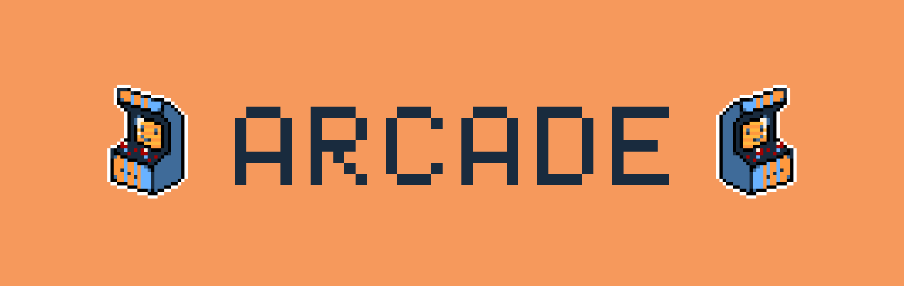

# arcade
Cross-platform arcade game emulator

## :information_source: Overview
The Arcade project is an interactive and modular gaming platform developed as part of the curriculum at Epitech. The project challenges students to create a flexible gaming framework capable of dynamically loading different game libraries and graphical user interfaces (GUIs).

## :book: Learning Objectives
- **Software Design**: Designing and implementing a modular and extensible software architecture.
- **Dynamic Linking**: Understanding dynamic linking and the use of dynamic libraries in C++.
- **Graphical Programming**: Gaining experience in graphical programming and interfacing with different graphics libraries.
- **Project Management**: Collaborating in teams, managing project timelines, and ensuring effective communication.

## :page_facing_up: Project Info
:tw-1f4e6: [Epitech Private Repository](https://github.com/EpitechPromo2027/B-OOP-400-NAN-4-1-arcade-baptiste.moreau "Epitech Private Repository")
:tw-1f4e6: [Group Remote Repository](https://github.com/sdragos1/arcade "Group Remote Repository")

## :computer: Developpers
- [Axel](https://github.com/AxelF44 "Axel")
- [Baptiste](https://github.com/BxptisteM "Baptiste")
- [Dragos](https://github.com/sdragos1 "Dragos")

## :electric_plug: Group Collaboration
The project has been realized in collaboration with this [other group](https://github.com/G-Epitech/FMY-Arcade "other group"). Their group master is [Mathéo Coquet](https://github.com/TekMath "Mathéo Coquet") that can be contacted at **mathéo.coquet@epitech.eu**.